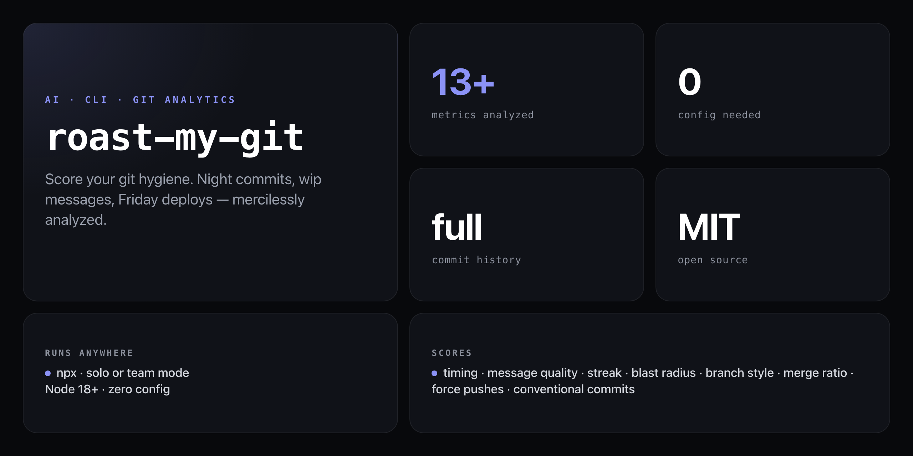

<div align="center">

**Your commit history is an unfiltered record of your habits. roast-my-git reads every line of it and tells you the truth.**


</div>

---

Code reviews catch bad code. Nothing catches bad git habits — until now. `roast-my-git` walks your full commit history and produces a no-mercy report: when you actually commit (2am?), how conventional your messages are, your longest streak, your biggest blast-radius commit, your branch naming style, and how often you reach for `--force`.

```
  roast-my-git
  Analyzing nick@example.com

  ────────────────────────────────────────────────────────────
  Total commits        347
  Commits per week     4.2
  Longest streak       12 days
  Active since         847 days

  Timing
  Most active hour     11pm  (night owl detected)
  Most active day      Wednesday
  Night commits        42  (12%)  — you live dangerously
  Weekend commits      31  (9%)
  Friday PM commits    8   (2%)   — classic

  Message Quality
  Conventional         61%  — room to grow
  Short messages       23   (7%)  — "wip", "fix", "x" count here
  Avg message length   38 chars

  Commit Size
  Average size         84 lines/commit
  Biggest single       1,204 lines  — that's a war crime

  Style
  Branch naming        kebab-case
  Merge commits        18%
  Force pushes         3   — you monster

  ────────────────────────────────────────────────────────────
```

## Install

No npm account needed — runs straight from GitHub:

```bash
npx github:NickCirv/roast-my-git
```

Run from inside any git repository.

## Usage

```bash
# Analyze your own commits (uses git config user.email)
npx github:NickCirv/roast-my-git

# Analyze a specific author
npx github:NickCirv/roast-my-git --author nick@example.com

# Analyze the whole team (top 10 contributors)
npx github:NickCirv/roast-my-git --team
```

| Flag | Description | Default |
|------|-------------|---------|
| `--author <email>` | Analyze a specific author by email | `git config user.email` |
| `--team` | Analyze all authors (top 10 by commit count) | off |

## What it analyzes

| Category | Metrics |
|----------|---------|
| **Timing** | Hour-by-hour breakdown, most active hour and day, night commits (10pm–4am), morning / afternoon / evening counts |
| **Weekend habits** | Weekend commit count and percentage |
| **Danger zones** | Friday afternoon commits (2pm–6pm), Monday cleanup commits |
| **Message quality** | Conventional commit compliance (`feat:`, `fix:`, etc.), average message length, short message count (≤4 chars) |
| **Streaks** | Longest consecutive-day commit streak |
| **Commit size** | Average lines changed per commit, biggest single-commit blast radius |
| **Style** | Branch naming convention (kebab-case / snake_case / camelCase), merge commit ratio, force push count |

## What it is NOT

- **Not a code quality tool.** It reads commit metadata and git history — it never touches your source files or diffs for logic.
- **Not a productivity score.** More commits is not better. The report surfaces patterns; interpretation is yours.
- **Not a surveillance tool.** It reads your local git log — nothing leaves your machine.

---

<div align="center">
<sub>Node 18+ · MIT · by <a href="https://github.com/NickCirv">NickCirv</a></sub>
</div>
