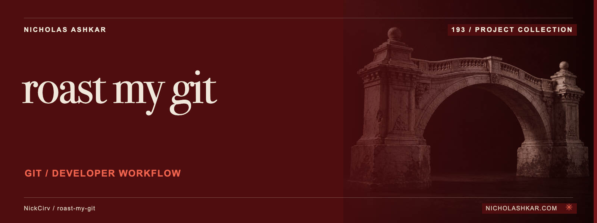

# roast-my-git

Turn local Git activity statistics into a lighthearted terminal report.

Analyzes commit timing, message lengths and history patterns for an author or a small team view. JSON exposes the underlying statistics without the commentary.


<a id="install"></a>

## Quickstart

Package runtime requirement: Node.js `>=20`. Git is needed to obtain this pinned source checkout.

```bash
git clone https://github.com/NickCirv/roast-my-git.git
cd roast-my-git
git checkout 3916336bd2dd124e89f1abfac438c4a02dcd9d93
npm install --ignore-scripts
node bin/roast.js --help
```

This source-derived example has not been executed in this review. Help describes the options. Run analysis from a repository containing the intended history.


<a id="what-it-analyzes"></a>

## Usage

```bash
node /path/to/roast-my-git/bin/roast.js --json
node /path/to/roast-my-git/bin/roast.js --author developer@example.com
node /path/to/roast-my-git/bin/roast.js --team
```

The default author comes from Git’s user.email. Team mode uses the top ten authors by commit count.

[Command reference](docs/REFERENCE.md) covers arguments, modes and output controls.


<a id="what-it-is-not"></a>

## Behavior and limits

These statistics are not a productivity or wellbeing assessment. Local reflog force-push heuristics are not a complete remote history and are not author-specific in the same way as the commit query. Squashing, rebasing, aliases and shallow history can skew results.

## Development

Declared package scripts:

| Script | Command |
| --- | --- |
| `start` | `node bin/roast.js` |
| `test` | `node bin/roast.js --help` |

The package test only prints help and was not executed. It provides no behavioral coverage of Git statistics.

## Research

[Source review and claim ledger](docs/RESEARCH.md) records revision `3916336bd2dd`, inspected files and verification gaps.

## License and attribution

Protected license and attribution files remain unchanged: [LICENSE](https://github.com/NickCirv/roast-my-git/blob/3916336bd2dd124e89f1abfac438c4a02dcd9d93/LICENSE).

[Artwork credits](assets/nicholas-ashkar/CREDITS.md) · [Nicholas Ashkar — consulting](https://nicholashkar.com/#oxblood-contact)
